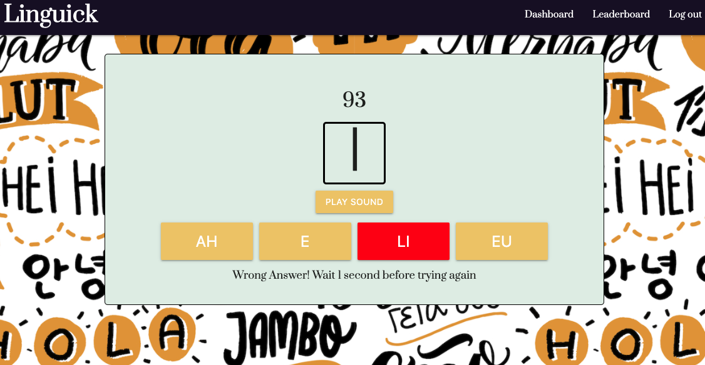

# Linguick

## Description 

This application provides the user with the opportunity to test their skill with reading Korean characters. The user can take quizzes to test their knowledge, which is also displayed on the Global Leaderboard.

## Table of Contents

* [Installation](#installation)
* [Usage](#usage)
* [MIT License](#mit_license)
* [Contributing](#contributing)
* [Tests](#tests)

## Installation

1. Clone the repo
2. Run 'npm install' to install dependencies
3. Run 'npm seed' to put in the quiz data
4. run 'npm start' to start the server
5. go to http://localhost:3000 to view the site

## Usage 

[Deployed site](https://linguick.herokuapp.com/)

On loading, you will be directed to the signup page. Once you log in, you can choose a quiz to take and taken it. Once you've taken a quiz, you can see your scores on the Dashboard page, or how you rank among other users on the Leaderboard page.
  
 
 
 
 
 
 

## MIT_License

Copyright (c) [2020] [Sam Dratch, Sharon Kim, John Robling, Daniel Rojas]

Permission is hereby granted, free of charge, to any person obtaining a copy
of this software and associated documentation files (the "Software"), to deal
in the Software without restriction, including without limitation the rights
to use, copy, modify, merge, publish, distribute, sublicense, and/or sell
copies of the Software, and to permit persons to whom the Software is
furnished to do so, subject to the following conditions:

The above copyright notice and this permission notice shall be included in all
copies or substantial portions of the Software.

THE SOFTWARE IS PROVIDED "AS IS", WITHOUT WARRANTY OF ANY KIND, EXPRESS OR
IMPLIED, INCLUDING BUT NOT LIMITED TO THE WARRANTIES OF MERCHANTABILITY,
FITNESS FOR A PARTICULAR PURPOSE AND NONINFRINGEMENT. IN NO EVENT SHALL THE
AUTHORS OR COPYRIGHT HOLDERS BE LIABLE FOR ANY CLAIM, DAMAGES OR OTHER
LIABILITY, WHETHER IN AN ACTION OF CONTRACT, TORT OR OTHERWISE, ARISING FROM,
OUT OF OR IN CONNECTION WITH THE SOFTWARE OR THE USE OR OTHER DEALINGS IN THE
SOFTWARE.

## Contributing

Contributors: Sam Dratch, Sharon Kim, John Robling, Daniel Rojas.
Not currently taking any additional contributions at this time.

## Tests

There is no test needed for this project. 